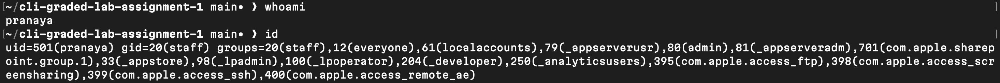
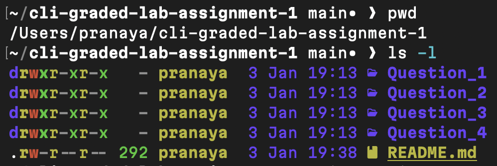
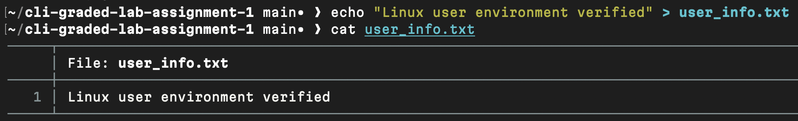
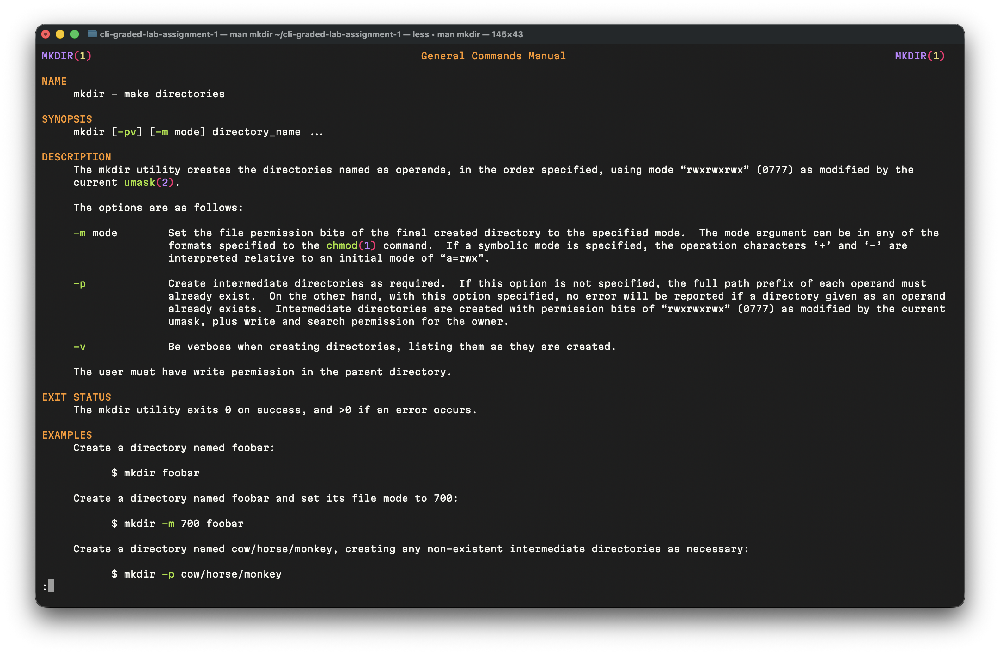
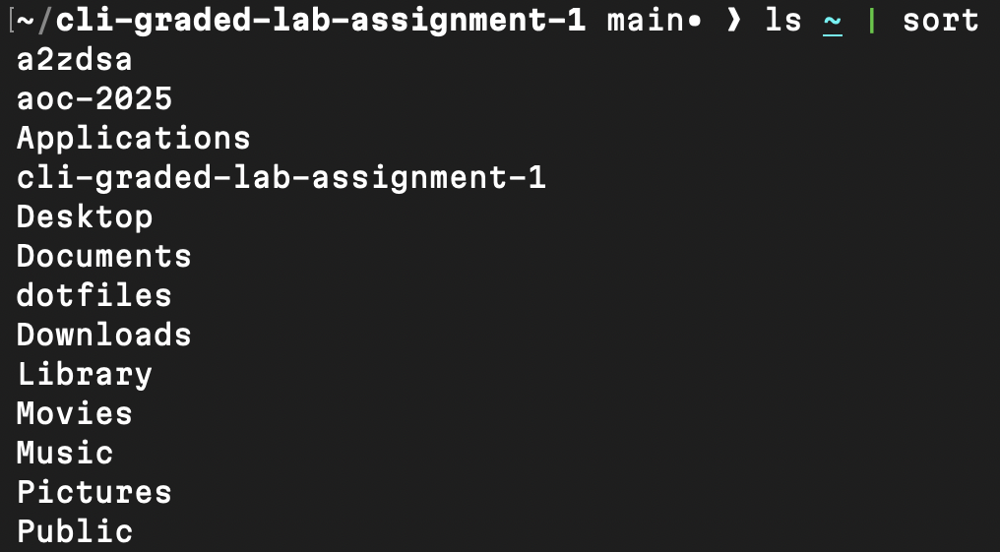
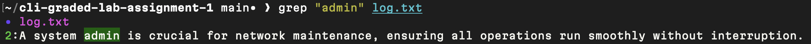
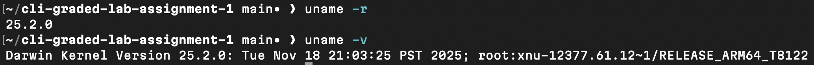
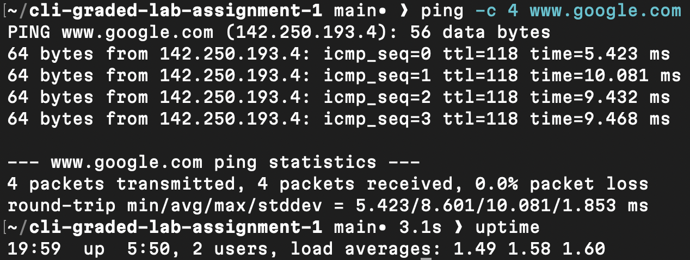

# Question 1

### 1. User Identity Verification

```
$ whoami
```
- `whoami` displays the currently logged-in username.

```
$ id
```
- `id` shows the user ID and all groups the account belongs to, confirming account identity and group membership.



---
### 2. Workspace Validation

```
$ pwd
```
- `pwd` prints the absolute path of the current working directory.

```
$ ls -l
```
- `ls -l` lists all files and directories in long format, showing permissions, ownership, size, and timestamps.



---
### 3. Environment Confirmation File

```
$ echo "Linux user environment verified" > user_info.txt
```
- This command creates `user_info.txt` if it does not exist and writes the specified confirmation line into the file.


[user_info.txt](user_info.txt)

---
### 4. File Integrity Check

```
$ wc -m user_info.txt
```
- `wc -m` counts and displays the number of characters in `user_info.txt`, verifying file content length.


---
### 5. Learning the Tools

```
$ man mkdir
```

```
$ mkdir -p Question_1/
```
- The -p option allows creation of parent directories as needed and does not error if the directory already exists.




---
### 6. Home Directory Inspection

```
$ ls ~ | sort
```
- `ls ~` lists the contents of the home directory, and `sort` orders the output alphabetically.



---
### 7. Log Investigation

```
$ grep "admin" log.txt
```
- `grep` searches `log.txt` and outputs only the lines that contain the word “admin”.


[log.txt](log.txt)

---
### 8. System Information Check

```
$ uname -r
```
- `uname -r` displays the version of the kernel (Darwin in this case) currently running.



---
### 9. Network Connectivity Check

```
$ ping -c 4 www.google.com
```
- This sends four ICMP echo requests to verify network connectivity and reports packet loss and response time.



---
### 10. System Health Awareness

```
$ uptime
```
- `uptime` shows how long the system has been running, the number of logged-in users, and the system load averages.


