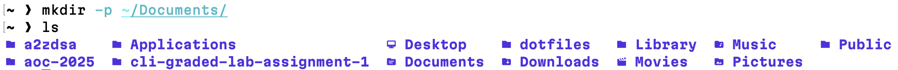
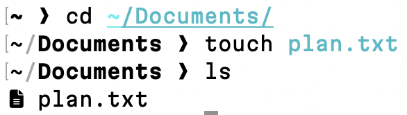
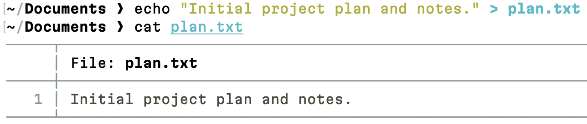
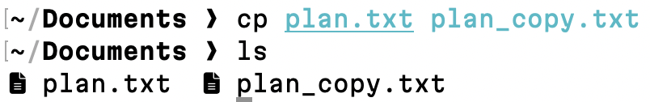
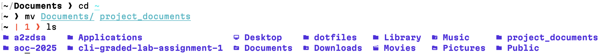
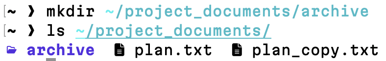
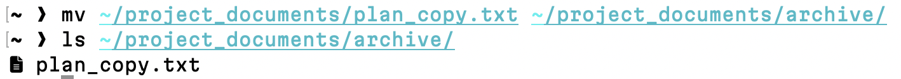
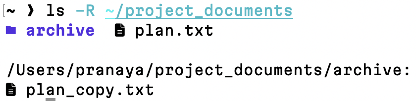

# Question 2

### 1. Project Workspace Setup

```
$ mkdir ~/documents
```
- This command creates a directory named documents inside the home directory to store project-related files.



---
### 2. File Creation

```
$ cd ~/documents
```
- `cd` changes the working directory to `documents`.

```
$ touch plan.txt
```
- `touch` creates an empty file named `plan.txt`.



---
### 3. Content Addition

```
$ echo "Initial project plan and notes." > plan.txt
```
- This writes sample text into `plan.txt`, replacing any existing content in the file.


[plan.txt](plan.txt)

---
### 4. File Metadata Verification

```
$ ls -l plan.txt
```
- `ls -l` displays file permissions, ownership, size, and timestamps, confirming the file is owned by the current user.


---
### 5. File Duplication

```
$ cp plan.txt plan_copy.txt
```
- This creates an exact copy of `plan.txt` named `plan_copy.txt` in the same directory.

  
[plan_copy.txt](plan_copy.txt)

---
### 6. Directory Renaming

```
$ mv documents project_documents
```
- `mv` renames the documents directory to `project_documents` to better reflect its purpose.



---
### 7. Archival Structure

```
$ mkdir ~/project_documents/archive
```
- This creates a subdirectory named `archive` inside `project_documents` for organizing archived files.



---
### 8. File Organization

```
$ mv ~/project_documents/plan_copy.txt ~/project_documents/archive/
```
- This moves `plan_copy.txt` into the `archive` subdirectory.



---
### 9. Recursive Listing

```
$ ls -R ~/project_documents
```
- `ls -R` lists all files and subdirectories recursively, showing the complete directory structure.



---
### 10. Path Verification

```
$ realpath ~/project_documents/archive/plan_copy.txt
```
- `realpath` outputs the absolute filesystem path of `plan_copy.txt` after it has been moved to the archive directory.


