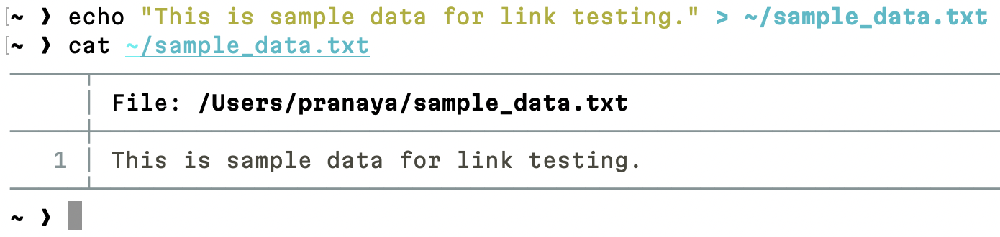
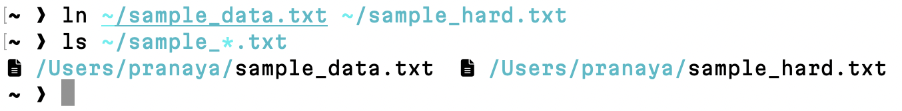
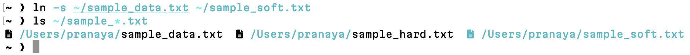
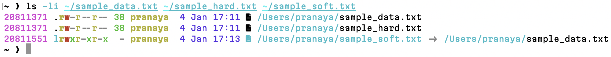
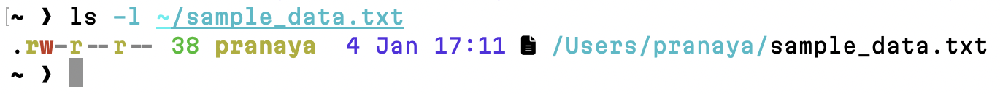
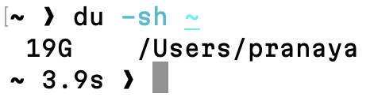
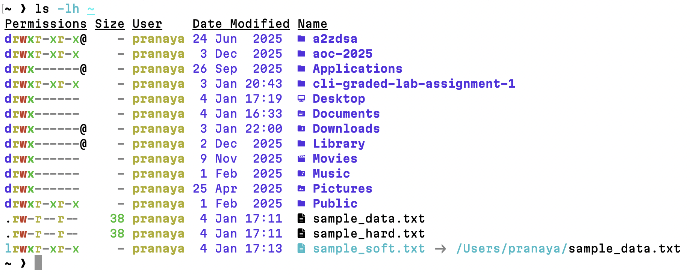
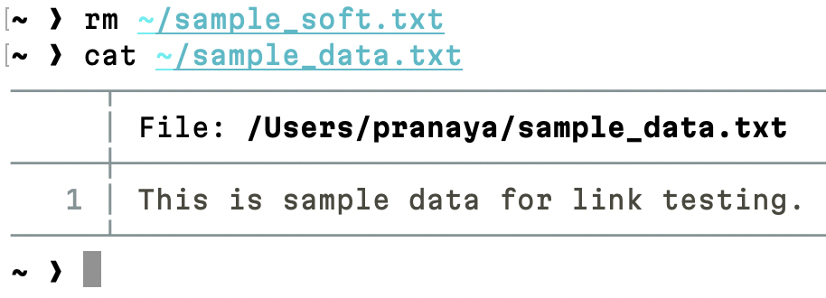
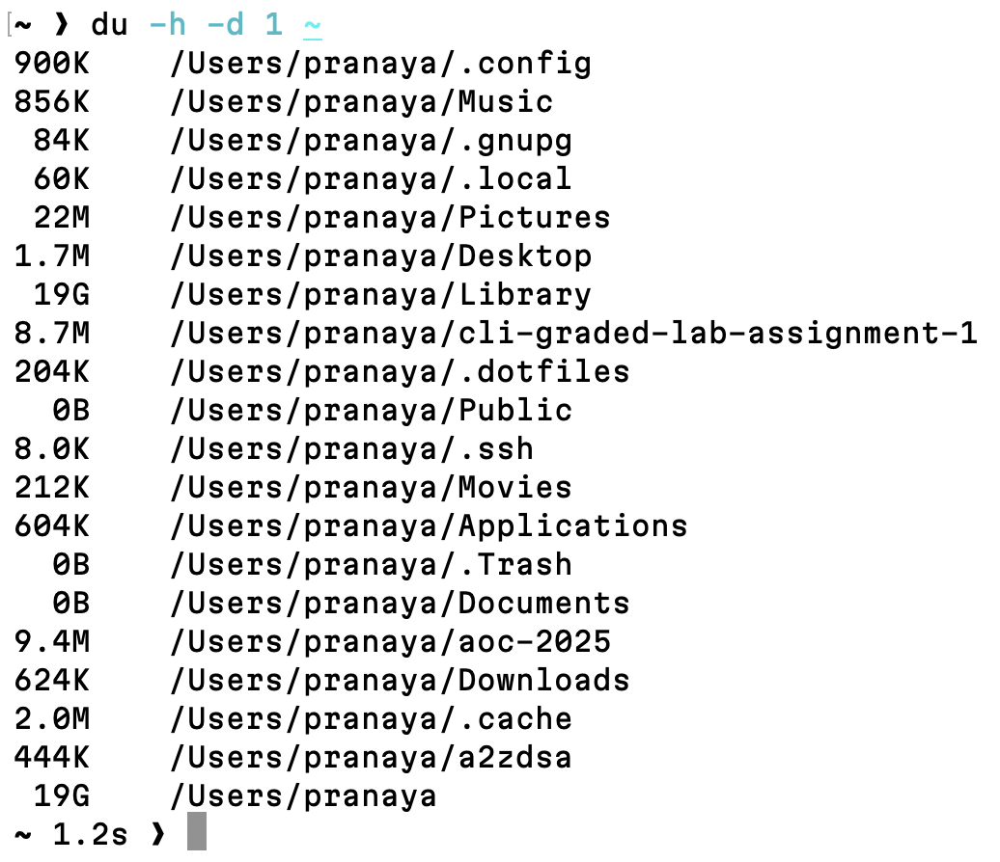
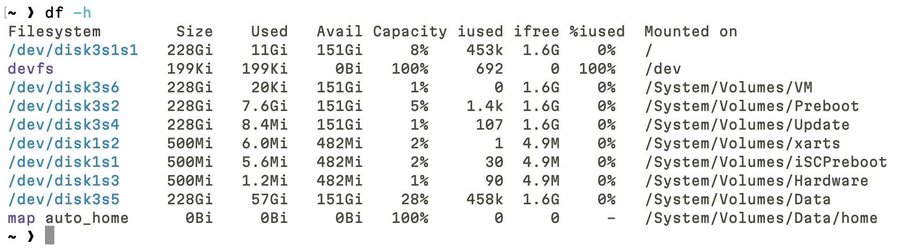

# Question 3

### 1. File Creation

```
$ echo "This is sample data for link testing." > ~/sample_data.txt
```
- This command creates `sample_data.txt` in the home directory and writes sample text into the file.


[sample_data.txt](sample_data.txt)

---
### 2. Hard Link Creation

```
$ ln ~/sample_data.txt ~/sample_hard.txt
```
- This creates a hard link named `sample_hard.txt` that points to the same inode as `sample_data.txt`.


[sample_hard.txt](sample_hard.txt)

---
### 3. Symbolic Link Creation

```
$ ln -s ~/sample_data.txt ~/sample_soft.txt
```
- This creates a symbolic link that references `sample_data.txt` by its pathname rather than sharing its inode.


[sample_soft.txt](sample_soft.txt)

---
### 4. Inode Verification

```
$ ls -li ~/sample_data.txt ~/sample_hard.txt ~/sample_soft.txt
```
- `ls -li` displays inode numbers, allowing comparison between the original file, hard link, and symbolic link.



---
### 5. Inode Analysis

- `sample_data.txt` and `sample_hard.txt` share the same inode because hard links reference the same filesystem object.
- `sample_soft.txt` has a different inode because it is a separate file that stores a path reference.

---
### 6. File Metadata Inspection

```
$ ls -l ~/sample_data.txt
```
- This displays permissions, ownership, file size, and timestamps for `sample_data.txt`.



---
### 7. Disk Usage Check

```
$ du -sh ~
```
- `du -sh` shows the total disk usage of the home directory in a human-readable format.



---
### 8. File Size Overview

```
$ ls -lh ~
```
- `ls -lh` lists files in the home directory along with their sizes in a human-readable format.



---
### 9. Link Deletion Test

```
$ rm ~/sample_soft.txt
```

```
$ cat ~/sample_data.txt
```
- Removing the symbolic link does not affect the original file, which remains accessible and unchanged.



---
### 10. Disk Utility Demonstration

```
$ du -h -d 1 ~
```
- `du -h -d 1` shows disk usage per directory level in the home directory.



```
$ df -h
```
- `df -h` displays filesystem-wide disk space usage, including total, used, and available space.


