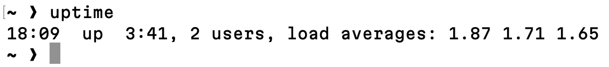
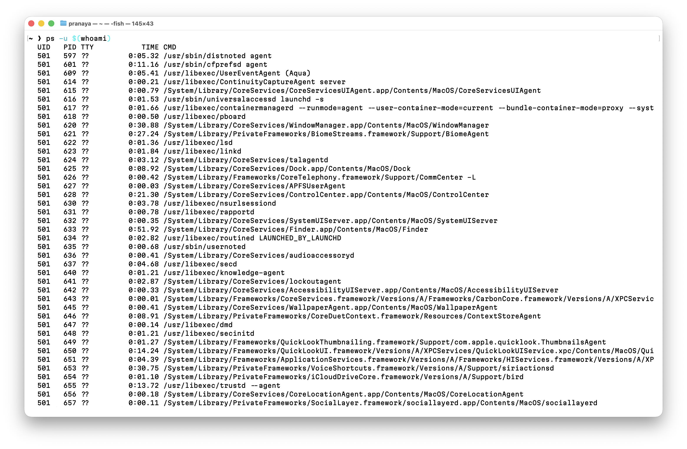
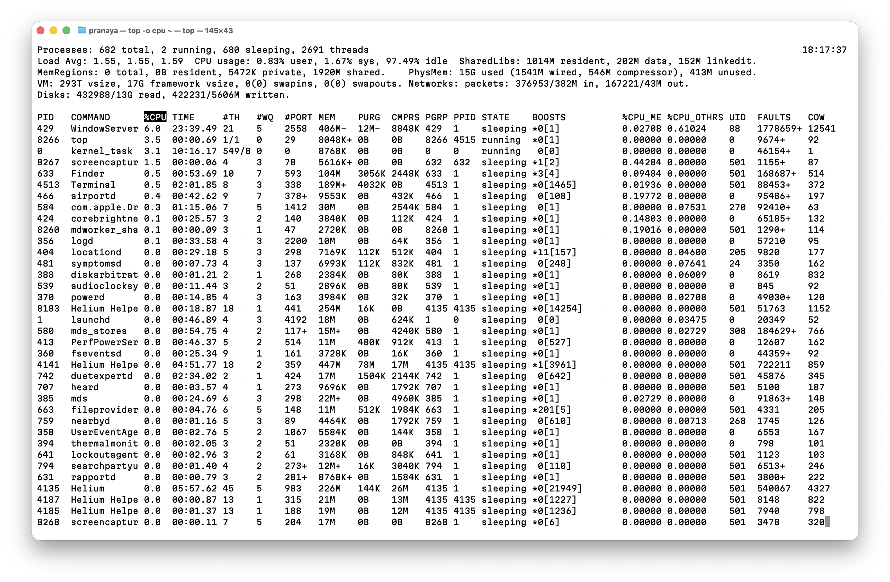
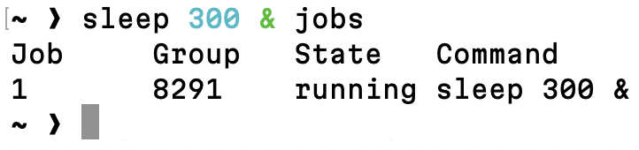
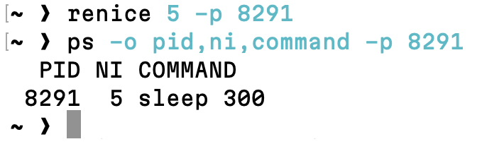
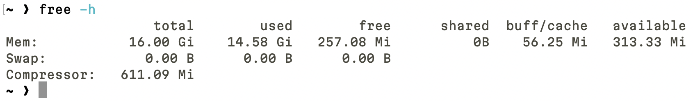
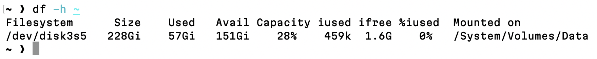
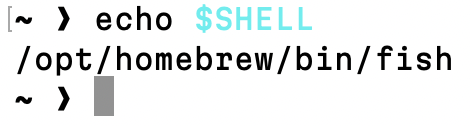
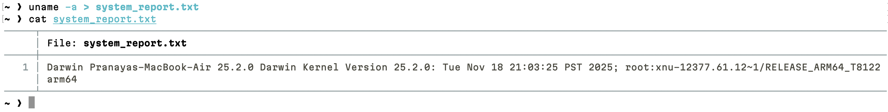
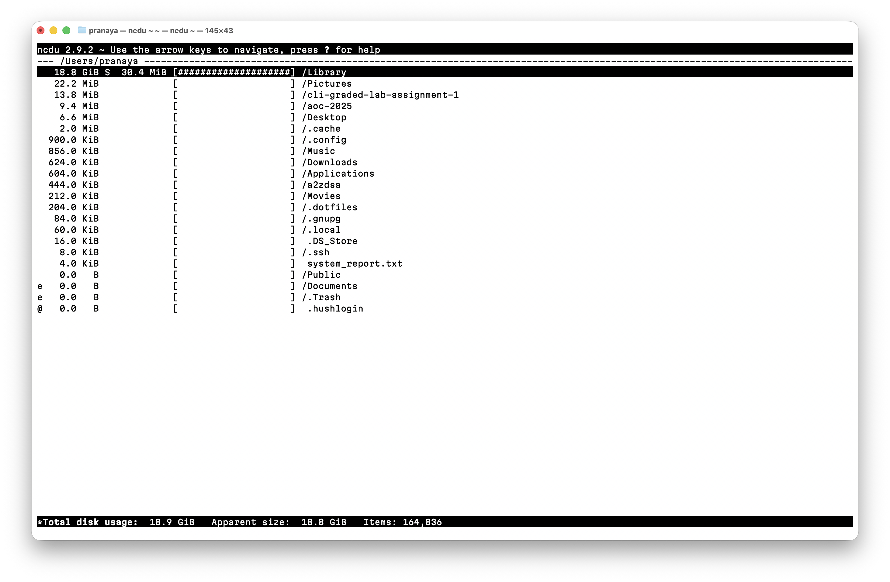

# Question 1

### 1. System Uptime Verification

```
$ uptime
```
- This command displays how long the system has been running since the last boot.



---
### 2. User Process Listing

```
$ ps -u $(whoami)
```
- `ps -u` lists all processes currently running under the logged-in user account.



---
### 3. CPU Usage Analysis

```
$ top -o cpu
```
- This lists user processes sorted by CPU usage, with the highest CPU-consuming process shown first.



---
### 4. Background Process Execution

```
$ sleep 300 & jobs
```
- `sleep 300 &` starts a background process, and `jobs` confirms that the background job is running.



---
### 5. Process Priority Management

```
$ renice 5 -p <PID>
```

```
$ ps -o pid,ni,command -p <PID>
```
- `renice` changes the priority (niceness) of the specified process, and `ps` confirms the updated niceness value.



---
### 6. Memory Usage Monitoring

```
$ free -h
```
- `free -h` displays system memory usage in a human-readable format, including used and available memory.



---
### 7. Disk Space Inspection

```
$ df -h ~
```
- This command shows disk space usage of the filesystem where the home directory resides.



---
### 8. Shell Identification

```
$ echo $SHELL
```
- This outputs the name and path of the shell currently in use.



---
### 9. Output Redirection

```
$ uname -a > system_report.txt
```
- This redirects system information output into the file `system_report.txt`.


[system_report.txt](system_report.txt)

---
### 10. Disk Usage Visualization

```
$ ncdu ~
```
- `ncdu` provides an interactive, text-based visualization of disk usage within the home directory, showing space consumed by files and directories.


